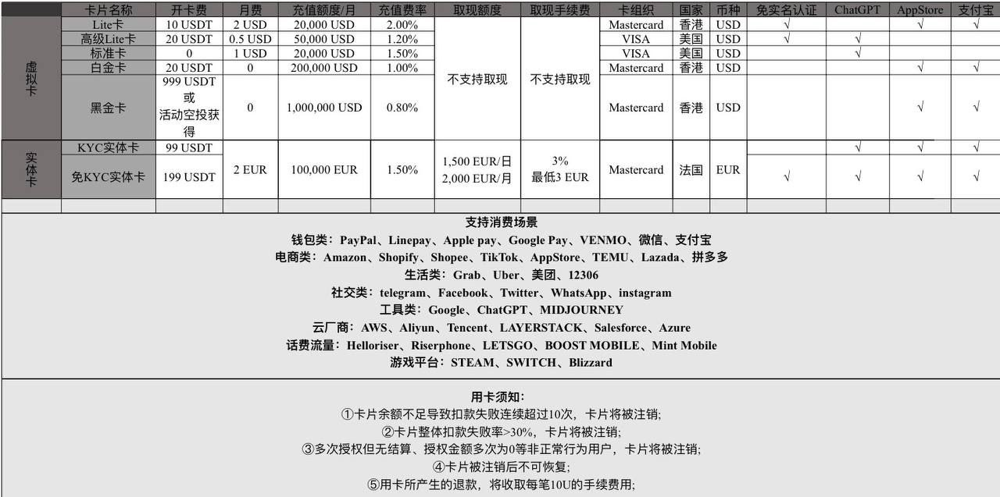
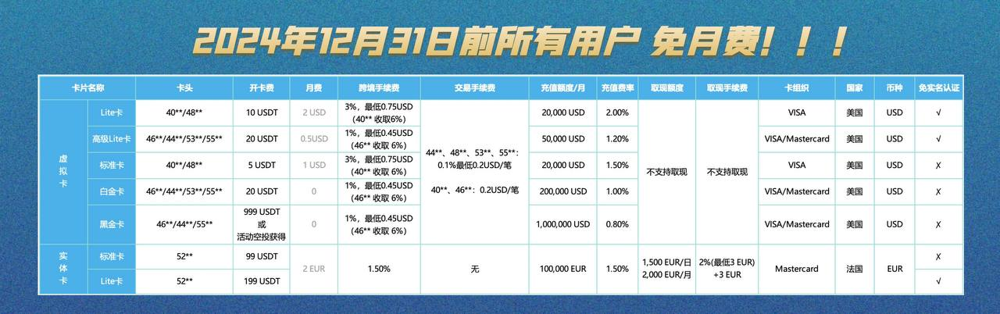
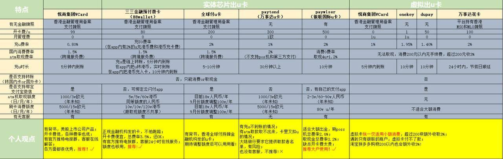

# Payment Cards
[Wikipedia](https://en.wikipedia.org/wiki/Payment_card)

Types:
- Credit cards
- Debit cards
- Charge cards
- ATM cards
- Stored-value cards
- Fleet cards
- Gift cards
- Digital currency

[Fake Credit Card Generator | CreditCardValidator](https://www.creditcardvalidator.org/generator)

## Card security code
[Wikipedia](https://en.wikipedia.org/wiki/Card_security_code)

[银行卡的CSC在哪找\_百度知道](https://zhidao.baidu.com/question/338929923.html)

## Cards
- 华美银行

  [2023 年个人 | 远程美国华美银行开户（非 Velo）指南及背景分析 - 旺旺来富](https://blog.wangwanglaifu.com/individual-east-west-bank-none-velo-account-opening/)

  - Velo

    [华美Velo卡被封，发生了什么？ 这两年因为Velo疫情原因，不能赴港办卡，不少人选择门槛较低的华美Velo卡，曲线入金港美股账户。Velo银行的优势： ... - 雪球](https://xueqiu.com/3721375055/196762818)

    [华美银行Velo 开始收开户费了，300美元！ - YouTube](https://www.youtube.com/watch?v=nQhDeEECMHs)

- [Wise](https://wise.com/)

  [跨境收款工具Wise免护照开户方法 - 知乎](https://zhuanlan.zhihu.com/p/503996880)

[海外营销必备工具(6)：美国虚拟银行账户 - 知乎](https://zhuanlan.zhihu.com/p/620251223)

[✏️不出内地完成美卡港卡开户的几种姿势](https://blog.infotogo.app/2020/03/test.html)

[在国内开美国银行账户 - 玩卡 / 银行账户 - 美卡论坛](https://www.uscardforum.com/t/topic/82070)

### China
- [招行、工行、农行、建行、中行五行的信用卡哪个最好用？为什么？ - 知乎](https://www.zhihu.com/question/19805928)
  - [建行，工行，中国银行对比哪个平常毛比较多一些呀？ - 建设银行讨论区 - 我爱卡论坛](https://bbs.51credit.com/forum.php?mod=viewthread&tid=7723180)

外币卡：
- [外币借记卡 -- DocOfCard](https://docofcard.com/archives/foreign-debit-card/)
- [跨境通VISA/万事达借记卡介绍与网上支付体验 - poplite's blog](https://poplite.xyz/post/2018/03/05/boc-debit-card-guide-for-online-payment.html)
- [办理visa卡经历 | nanodesu~](https://fnsflm.xyz/2021/03/12/2021-03-12/%E5%8A%9E%E7%90%86visa%E5%8D%A1%E7%BB%8F%E5%8E%86/)
- [工行星座卡VISA卡（学生版）使用答疑【大学生信用卡+visa卡使用注意事项】 - 知乎](https://zhuanlan.zhihu.com/p/541229547)
  - [大学生的第一张信用卡------工行星座卡 | 道之远兮](https://dzyx.uk/2023/07/14/42/)

[中国银行手机银行购汇与转账教程 - poplite's blog](https://poplite.xyz/post/2018/04/19/how-to-purchase-foreign-currency-in-boc-mobile-bank.html)
- > 但是现在最大的问题不是新办理的借记卡压根很难办理到1类卡，需要很充足的材料证明你确实需要1类卡，否则只能开2类卡。国家的反电信诈骗政策已经基本把这套路子搞死了。

[普通大陆居民可以开立哪些正规靠谱的海外银行账户？ - V2EX](https://www.v2ex.com/t/995060)

[朋友准备润，香港开户转了一笔 5 万刀被锁了 - V2EX](https://www.v2ex.com/t/975854)

[信用卡的名字问题 - 玩卡 / 信用卡 - 美卡论坛](https://www.uscardforum.com/t/topic/43366)

## Crypto cards  
- [Dupay](https://depay.depay.one/) (Depay)
  - Card opening fee: 0 USDT ~ 50 USDT
  - Monthly fee: 2 USDT ~ 0 USDT
  - Card recharge charge: 2% ~ 0.8%

  [Depay虚拟卡国内日常消费使用实测报告 -- 土木坛子](https://tumutanzi.com/archives/17008)

- [OneKey Card](https://card.onekey.so/)
  - Fiat conversion fee: 1.95% ~ 1.5%
  - Withdraw: 1%
  
  [OneKey Card虚拟信用卡全面实测（和Depay比较） -- 土木坛子](https://tumutanzi.com/archives/17027)

  [Dupay和OneKey Card虚拟信用卡的最新变化 -- 土木坛子](https://tumutanzi.com/archives/17042)

- ~~[Poko](https://www.pokoapp.xyz/)~~
  - Top up: 1% (min $0.5) ~ 0%
  - Withdraw: 0.6%

  History:
  - 2023-08 [推荐个不需要认证的虚拟卡 - V2EX](https://www.v2ex.com/t/966937)
  - 2023-09 [Poko Card跑路了😅](https://www.nodeseek.com/post-25329-1)

- [VCard](https://51vcard.com/)
  - 充值：1.35% ~ 0.8%

  

  

  - 2023-09 [带实体银行卡的虚拟卡：VCard -- 土木坛子](https://tumutanzi.com/archives/17086)
  - 2023-09 [推荐一款费率最低的 U 卡，吊打隔壁 Dupay 和 Onekey - V2EX](https://www.v2ex.com/t/974297)
  - 2023-10-13 “即日起到明年年底（2024年12年31），对所有的用户采用免月租的优惠政策”

- [RedotPay](https://www.redotpay.com/zh/personal/card/)

  

  [小红卡（RedotPay）使用指南](https://bituncle.com/news/)

  [Networks and Cryptocurrencies supported by RedotPay -- RedotPay Help Center](https://support.redotpay.com/hc/en-us/articles/7262650734223-Networks-and-Cryptocurrencies-supported-by-RedotPay)

  > Why can't I open a card and bind it to PayPal or transact through Alipay?
  > 
  > Answer: After you have activated the card, Visa will synchronize data with institutions like PayPal. Some users may encounter slower synchronisation, but the vast majority of users will be able to use it within 2 days. If the transaction fails, please do not repeat the transaction, as it may be regarded by Visa as a malicious transaction and the card may be frozen. Please wait for a while before another attempt.

  邀请有购卡、消费和二级返佣。

- [FOMEPay](https://www.fomepay.com/)

  - 充值：5% ~ 1%
  - 充值方式：微信、支付宝（维护）、USDT-TRC20

- [WildCard](https://bewildcard.com/)
  - 开卡：$16
  - 充值：3.5%

[国外虚拟数字银行卡 | 虚拟信用卡合集 | 合集网](https://233heji.com/1526.html)

[现在有什么 U 卡可以绑定国内应用，用于日常消费的？ - V2EX](https://www.v2ex.com/t/998229)